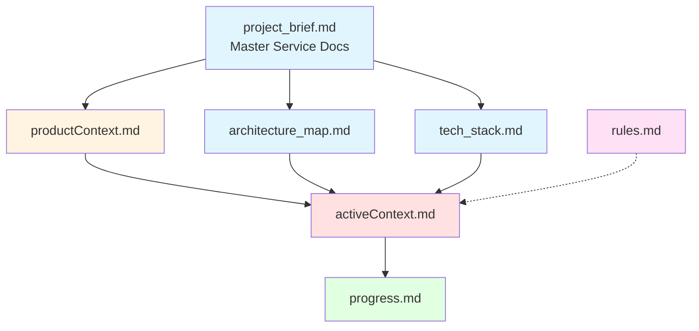
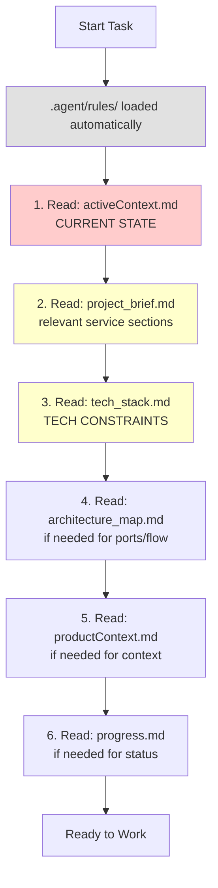
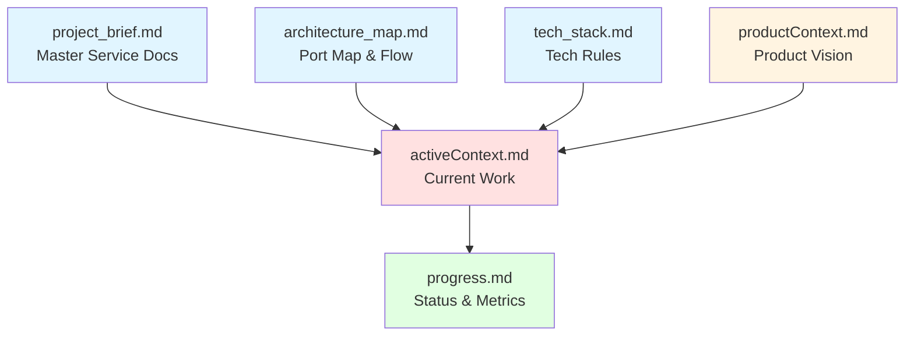
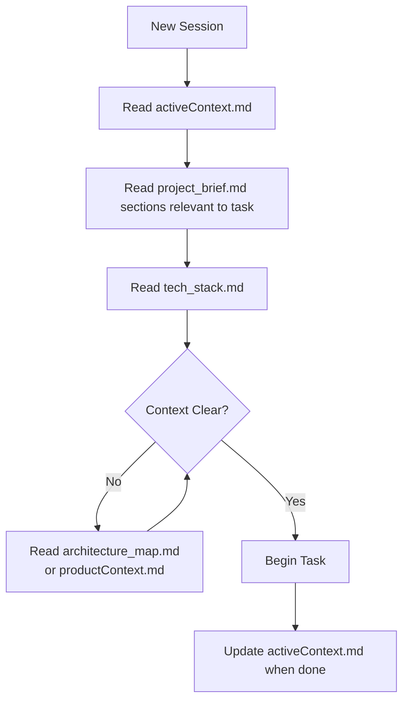
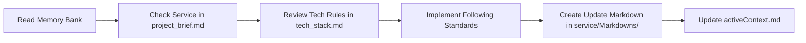
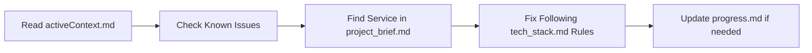
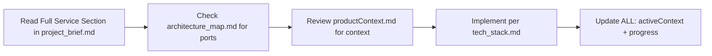
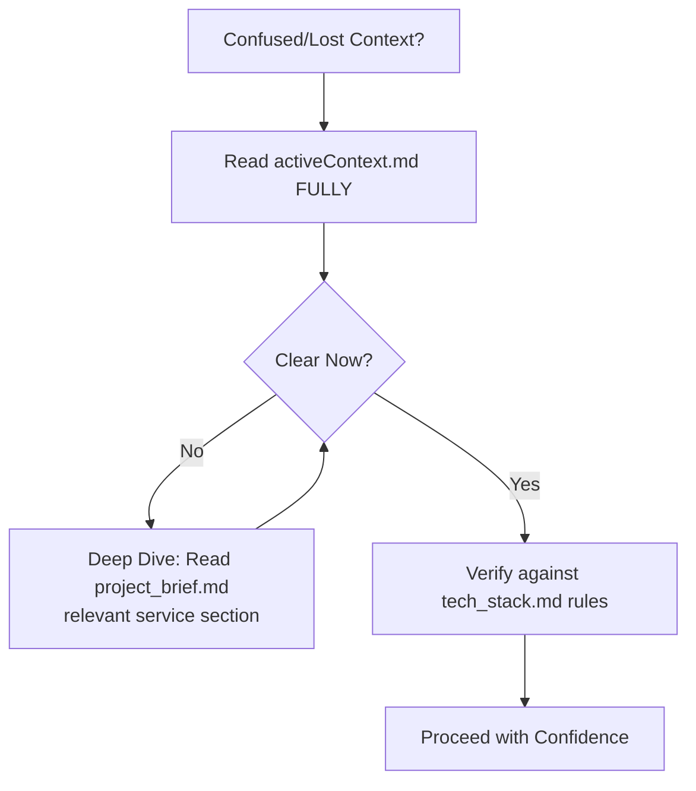
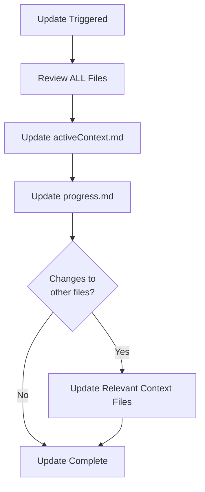
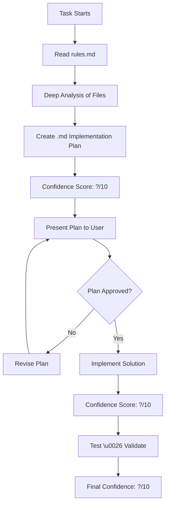

# AI Assistant Memory Bank Protocol - System Tickets Services

I am an AI coding assistant with a unique characteristic: my memory resets completely between sessions. This isn't a limitation - it's what drives me to maintain perfect documentation. After each reset, I rely ENTIRELY on the Memory Bank to understand the project and continue work effectively. I MUST read ALL memory bank files at the start of EVERY task - this is not optional.

---

## Project Overview

**System Tickets Services** is an enterprise-grade microservices-based ticketing and IT support management platform with 15+ microservices, built using Laravel (backend), Nuxt.js/Vue 3 (frontend), and PostgreSQL databases.

### Key Characteristics
- **Architecture**: Microservices with dedicated databases per service
- **Communication**: REST APIs (sync) + RabbitMQ (async)
- **Infrastructure**: Docker Compose, Kong Gateway, Redis, PostgreSQL
- **Scale**: 15 microservices, 50,000+ lines of code
- **Tech Stack**: Laravel 11/12, Nuxt 3, Vue 3, Tailwind CSS 4, PHP 8.2+, TypeScript

---

## Memory Bank Location

**Location**: `/home/hachahbo/system-tickets-services/.memory-bank/`

When starting any task, this directory exists and contains all necessary context files.

---

## Memory Bank Structure

The Memory Bank consists of core files and optional context files, all in Markdown format. Files build upon each other in a clear hierarchy:



### Core Files Structure

```
.memory-bank/
├── README.md                 # Memory bank concept explanation
├── project_brief.md          # Master documentation of all 15 services
├── architecture_map.md       # Port mappings and data flow rules
├── tech_stack.md             # Technologies and coding standards
├── productContext.md         # Product vision and business context
├── activeContext.md          # Current development status
├── progress.md               # Progress tracking and metrics
└── agent-memory-guide.md     # This file
```

**Note**: AI agent coding rules are now in `.agent/rules/` folder, not in memory bank.

---

## File Reading Protocol

At the start of EVERY task, I MUST read files in this order:



### Reading Priority

| Priority | File | When to Read | Purpose |
|----------|------|--------------|---------|
| **AUTO** | `.agent/rules/*` | Always loaded | Coding discipline (auto-loaded by IDE) |
| **CRITICAL** | `activeContext.md` | EVERY task | Current work, recent changes |
| **HIGH** | `project_brief.md` | Service-related tasks | Service details, APIs, architecture |
| **HIGH** | `tech_stack.md` | Writing code | Coding standards, constraints |
| **MEDIUM** | `architecture_map.md` | Need ports/flow | Quick reference for infrastructure |
| **MEDIUM** | `productContext.md` | Product decisions | Why features exist |
| **LOW** | `progress.md` | Status checks | Overall progress |

---



---

## Core Files (MUST READ on Every Session)

### 1. `project_brief.md` ⭐ FOUNDATION
**Purpose**: Complete documentation of all 15 microservices
**Read When**: Starting ANY task involving services
**Contains**:
- Detailed service descriptions (auth, ticket, categorization, priority, etc.)
- Port mappings for all services
- Technology stack per service
- Make commands reference
- Database schemas
- Service responsibilities

**Critical**: This is the single source of truth for service architecture.

---

### 2. `architecture_map.md` 🗺️ QUICK REFERENCE
**Purpose**: Fast lookup for ports, infrastructure, and data flow
**Read When**: Need quick service port or URL
**Contains**:
- Infrastructure ports (Kong: 8000/8001, RabbitMQ: 15672, Redis: 6379)
- All 15 microservices with ports
- Data flow rules (Kong → Service → RabbitMQ/Redis)
- Quick service table

**Usage**: Use this for port lookups; use `project_brief.md` for deeper service understanding.

---

### 3. `tech_stack.md` 💻 CODING RULES
**Purpose**: Technical standards and constraints
**Read When**: Writing ANY code
**Contains**:
- Backend: Laravel 11/12, PHP 8.2+, Service Pattern
- Frontend: Nuxt 3, Vue 3 Composition API, Tailwind CSS 4
- Critical constraints (NO direct DB access between services)
- Coding standards (strict types, return types)

**Critical Rule**: Services CANNOT access each other's databases directly. Must use APIs or RabbitMQ.

---

### 4. `productContext.md` 🎯 PRODUCT VISION
**Purpose**: Why this project exists and what it solves
**Read When**: Making product/UX decisions
**Contains**:
- Product value propositions
- Target users (IT teams, admins, end users)
- Key features (automation, RBAC, real-time chat, AI)
- Competitive advantages
- Business impact

**Use For**: Understanding user needs and product direction.

---

### 5. `activeContext.md` 🔥 CURRENT STATE
**Purpose**: What's happening RIGHT NOW in development
**Read When**: EVERY session start
**Contains**:
- Recently completed features (with dates)
- In-progress work
- Known issues and blockers
- Active services under development
- Recent architectural decisions
- Environment status

**Update Frequency**: After every significant feature or change
**Critical**: This tells you exactly where development left off.

---

### 6. `progress.md` 📊 TRACKING & METRICS
**Purpose**: Overall project progress and completion status
**Read When**: Need project overview or status check
**Contains**:
- Service completion percentages (Frontend: 90%, Auth: 95%, etc.)
- Feature milestones by phase
- Recent achievements (last 7 days)
- Metrics and KPIs
- Next quarter goals

**Update Frequency**: Weekly or after major milestones

---

## Critical Microservices Overview

Quick reference for the 15 core services:

| Service | Port | Status | Purpose |
|---------|------|--------|---------|
| **frontend-service** | 3000 | 90% | Nuxt 3 UI |
| **auth-service** | 8003 | 95% | JWT Auth |
| **ticket-service** | 8005 | 85% | Ticket CRUD |
| **categorization-service** | 8006 | 85% | Categories & Dynamic Forms |
| **priority-service** | 8004 | 80% | Priority Matrix |
| **intervention-service** | 8011 | 90% | Auto Remediation |
| **acl-service** | 8013 | 95% | RBAC Permissions |
| **assignment-service** | 8007 | 75% | Ticket Assignment |
| **organization-service** | 8008 | 80% | Teams & Orgs |
| **notification-service** | 8009 | 70% | Multi-channel Alerts |
| **escalation-service** | 8015 | 65% | SLA & Escalation |
| **review-service** | 8012 | 60% | QA & Feedback |
| **chat-service** | 8014 | 75% | Real-time Chat |
| **reverb-service** | 8010/8080 | 90% | WebSocket Server |
| **llm-service** | 11434 | 70% | AI/Ollama |

---

## Agent Workflows

### Session Start Protocol ✅

**EVERY time you start working, you MUST:**



**Minimum Required Reading**:
1. `activeContext.md` (always)
2. Relevant sections of `project_brief.md` (for service details)
3. `tech_stack.md` (for coding rules)

---

### Task Execution Workflow

#### For Feature Development


#### For Bug Fixes


#### For New Service Work


---

## Documentation Update Protocol

### When to Update Memory Bank

| Trigger | Files to Update | Priority |
|---------|----------------|----------|
| **Feature completed** | `activeContext.md`, `progress.md` | HIGH |
| **Service architecture change** | `project_brief.md`, `architecture_map.md` | CRITICAL |
| **Tech stack change** | `tech_stack.md` | CRITICAL |
| **New service added** | `project_brief.md`, `architecture_map.md`, `progress.md` | CRITICAL |
| **End of sprint** | `progress.md`, `activeContext.md` | MEDIUM |
| **User requests "update memory bank"** | Review ALL files | HIGH |

---

### Service-Specific Documentation

Each service has its own `Markdowns/` folder for feature updates:

```
categorization-service/
  └── Markdowns/
      └── API_SCHEMA_PARSER_UPDATE.md

priority-service/
  └── Markdowns/
      └── PRIORITY_SYSTEM_SEEDERS_UPDATE.md
```

**Protocol**: Create a new markdown file in `service/Markdowns/` for each significant feature or update.

---

## Project-Specific Rules

### Microservices Communication (CRITICAL) 🚨

```
✅ ALLOWED:
- Service A → Kong Gateway → Service B API
- Service A → RabbitMQ → Service B Consumer
- Service A → Redis (cache)

❌ FORBIDDEN:
- Service A → Direct DB Connection → Service B's Database
```

### Code Standards

**Backend (Laravel)**:
```php
declare(strict_types=1);

// Always use Service Pattern
Controller → Service → Repository

// Always define return types
public function create(array $data): Model
{
    // Implementation
}
```

**Frontend (Nuxt/Vue)**:
```typescript
// Use Composition API
<script setup lang="ts">
import { useFetch } from '#app'

// Use composables for data fetching
const { data } = await useFetch('/api/endpoint')
</script>
```

### Make Commands (Essential)

```bash
# MUST USE for all operations
make quick-start         # Start all services
make logs-[service]      # View logs
make shell-[service]     # Access container
make restart-[service]   # Restart service
```

**Never**: Use `docker compose` directly; always use `make` commands.

---

## Context Restoration Checklist

When starting a new session, verify you understand:

- [ ] What was last worked on (`activeContext.md`)
- [ ] Which service(s) are affected (`project_brief.md`)
- [ ] Current progress status (`progress.md`)
- [ ] Coding standards for the language (`tech_stack.md`)
- [ ] Service architecture and ports (`architecture_map.md`)
- [ ] Why this feature exists (`productContext.md`)

---

## Quick Decision Matrix

| Question | Consult This File |
|----------|------------------|
| What port does X service use? | `architecture_map.md` |
| What technology does X service use? | `project_brief.md` → Service section |
| How do I communicate between services? | `tech_stack.md` → Critical Constraints |
| What's the current work status? | `activeContext.md` |
| What's left to build? | `progress.md` |
| Why does this feature exist? | `productContext.md` |
| How do I run migrations? | `project_brief.md` → Getting Started |

---

## Memory Bank Maintenance

### Agent Responsibilities

As an AI agent, you MUST:
1. ✅ Read relevant memory bank files at session start
2. ✅ Update `activeContext.md` after significant work
3. ✅ Update `progress.md` weekly or after milestones
4. ✅ Create service-specific markdown docs for features
5. ✅ Keep documentation concise and accurate
6. ✅ Follow the project's microservices rules strictly

### Update Template

When updating `activeContext.md`:
```markdown
## Recently Completed Features

### ✅ Feature Name (YYYY-MM-DD)
**Service**: [service-name]
- What was implemented
- Files modified
- **Status**: [Deployed/Testing/Ready]
```

---

## Common Pitfalls to Avoid

### ❌ Don't Do This
- Write code that accesses another service's database directly
- Use `docker compose` commands instead of `make`
- Skip reading `activeContext.md` at session start
- Forget to update memory bank after significant work
- Ignore the microservices communication rules

### ✅ Do This Instead
- Use APIs or RabbitMQ for inter-service communication
- Use `make` commands for all Docker operations
- Read `activeContext.md` FIRST, always
- Update memory bank after every feature/fix
- Follow the tech stack rules in `tech_stack.md`

---

## Emergency Recovery

If you're confused or lost:



---

## Version Control

**Memory Bank Git Protocol**:
- Memory bank files are committed with feature changes
- Update markdown docs are created per feature
- `activeContext.md` and `progress.md` updated weekly minimum

---

## Update Triggers

Memory Bank updates should occur when:

1. Discovering new patterns or insights
2. After implementing significant changes
3. When user requests an update using ANY of these phrases:
   - "update memory bank"
   - "update the memory bank"
   - "refresh memory bank"
   - "sync memory bank"
   - "save context"
4. When context needs clarification
5. At the end of a major task or session (offer proactively)

### Update Process Workflow



When triggered, I MUST:
- Review ALL existing files (even if no changes needed)
- Update **`activeContext.md`** with current focus
- Update **`progress.md`** with latest status
- Add new insights to relevant context files

---

## Coding Rules Protocol (.agent/rules/) (CRITICAL)

The `.agent/rules/` folder contains **MANDATORY rules** that define agent behavior:

### memory-bank.md
**Always enforces reading the memory bank at session start**. This rule ensures:
- Read `activeContext.md` before ANY work
- Consult `architecture_map.md` for infrastructure questions
- Check `tech_stack.md` before writing code
- Update memory bank after completing tasks

### wake-up.md
**Defines coding discipline and standards**. Contains:

### 7 Core Rules

1. **Deep Analysis Required**
   - Analyze ALL relevant project files before coding
   - Never stop analysis early
   - **Provide confidence score (1-10)** with every analysis

2. **Full Context Gathering**
   - Ensure complete understanding before implementation
   - Read all necessary memory bank files

3. **Implementation Plan Required**
   - Create `.md` implementation plan outlining:
     - Goals, Architecture, Steps
     - Edge cases, Dependencies
     - Validation strategy
   - **MUST be approved before coding**

4. **Confidence Scoring**
   - Provide confidence rating **(1-10)** at:
     - Before saving files
     - After saving
     - After rejection/reconsideration
     - Before task completion

5. **Project Integrity**
   - Inspect existing files before structural changes
   - Verify architecture compatibility

6. **Challenge Assumptions**
   - Ask direct questions
   - Push back on unclear requirements
   - Verify best implementation approach

7. **Plan-First Enforcement**
   - **NEVER write code until plan is approved**
   - Implementation plan must be explicit

### Workflow with Rules.md



---

## IDE Integration

### Antigravity (Google DeepMind)
This file has `---\nalwaysApply: true\n---` frontmatter and is automatically loaded.

### Cursor
Copy excluding YAML frontmatter to **`.cursorrules`** in project root.

### GitHub Copilot
Add to **`.github/copilot-instructions.md`** in project root.

### Claude/ChatGPT
Include in system prompt or custom instructions for the project.

### VS Code with Continue
Add to **`config.json`** in Continue extension settings under custom instructions.

---

## Critical Reminders

> [!IMPORTANT]
> After every memory reset, I begin completely fresh. The Memory Bank is my ONLY link to previous work. It must be maintained with precision and clarity, as my effectiveness depends entirely on its accuracy.

> [!NOTE]
> When triggered by **update memory bank**, I MUST review every memory bank file, even if some don't require updates. Focus particularly on `activeContext.md` and `progress.md` as they track current state.

> [!TIP]
> Keep memory bank files concise and focused. Use service-specific `Markdowns/` folders for detailed feature documentation.

---

## Final Reminders

**For AI Agents**:
> Your memory resets between sessions. The Memory Bank is your ONLY link to previous work. Treat it as your external brain. Read it. Update it. Trust it.

**Critical Success Factors**:
1. 📖 **Read First**: Always read memory bank before coding
2. 📋 **Follow Rules**: Read and apply `rules.md` EVERY time
3. 🚫 **Respect Boundaries**: Never cross microservices database boundaries
4. 📝 **Document Changes**: Update memory bank after significant work
5. 🛠️ **Use Make**: All Docker operations via Makefile
6. 📚 **Stay Current**: Keep `activeContext.md` up to date
7. 🎯 **Plan First**: Never code without approved implementation plan

---

**Last Updated**: 2025-12-12  
**Project Phase**: Active Development  
**Memory Bank Version**: 2.0
